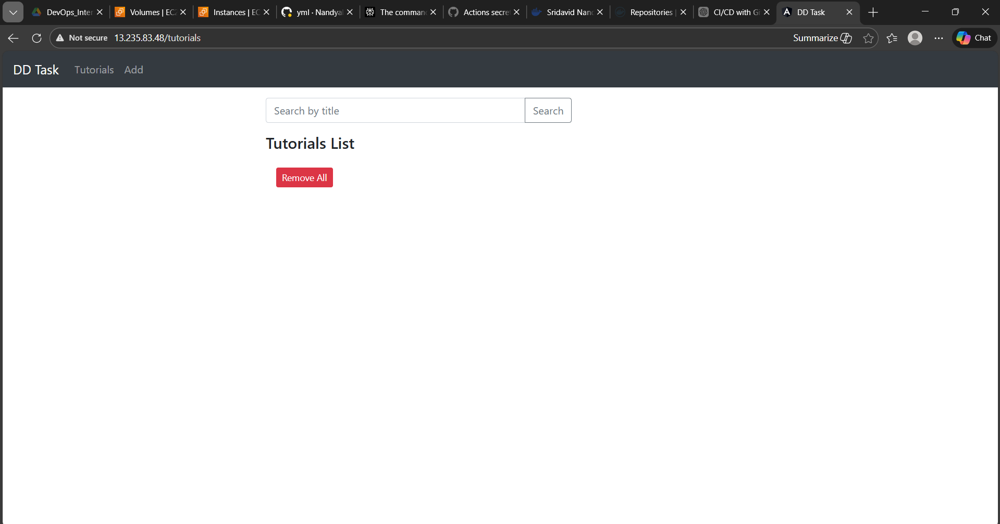
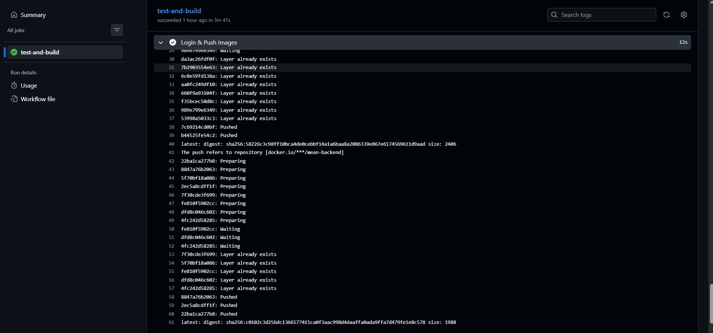

In this DevOps task, you need to build and deploy a full-stack CRUD application using the MEAN stack (MongoDB, Express, Angular 15, and Node.js). The backend will be developed with Node.js and Express to provide REST APIs, connecting to a MongoDB database. The frontend will be an Angular application utilizing HTTPClient for communication.  

The application will manage a collection of tutorials, where each tutorial includes an ID, title, description, and published status. Users will be able to create, retrieve, update, and delete tutorials. Additionally, a search box will allow users to find tutorials by title.

## Project setup

### Node.js Server

cd backend

npm install

You can update the MongoDB credentials by modifying the `db.config.js` file located in `app/config/`.

Run `node server.js`

### Angular Client

cd frontend

npm install

Run `ng serve --port 8081`

You can modify the `src/app/services/tutorial.service.ts` file to adjust how the frontend interacts with the backend.

Navigate to `http://localhost:8081/`

### I'm good at AWS cloudplatform.

I created an isolated network Virtual Private Cloud(VPC) with two subnets.

I attached the Internet-gateway to the VPC.

I created a security group by allowing protocols ssh,http and https on ports 22,80, and 443.

I launched an EC2 instance in mumbai with "ubuntu OS" and "t2.large" instance.

I ssh a vm on my local server.

### Repository on Github

I created a repository.

I uploaded the project MEAN files into repostory.

I pushed the Dockerfiles ,Dockercomposefile and nginx.conf into repostory after setup.

### Dockerfiles

backend dockerfile => tested manually on vm.

Run  `docker build image -t backend:1 .` 

frontend dockerfile => tested manually on vm.

Run  ` docker build image -t frontend:1 .                                                       `

setup the nginx configuration to application listen on port 80. 

finally tested both the images with docker compose including mongodb by pulling image from registry.

Run  `docker compose up -d `

Navigate to `http://13.235.83.48:80`

## frontend screenshot 
 
 

### CI&CD Pipeline 

I'm good at Github Actions.

I created continous integration and continous deployment automated pipeline.

I used github actions marketplace reusable actions to setup node and to checkout the code.

## frontend
To Install and download dependecey packages 

Run `npm ci`

To Test the code 

Run `npm run test`

To build the app

Run `npm run build`

## backend 

To install and download dependecies

Run `npm install`

To Test the code 

Run `npm test`

## docker hub setup

I store the registry credentials as github secrets.

I setup the secrets as DOCKERHUBUSERNAME AND DOCKERHUBTOKEN then I referenced as ${{Dockerhub.username}} and ${{Dockerhub.token}} in pipeline.

I pushed the image to dockerhub registry.

I setup the vm credentials in Github secrets to automate the deployment.

finally the pipeline deploys the containers with updated images by docker compose.

## CiCD configuration and Docker images

 
 .

